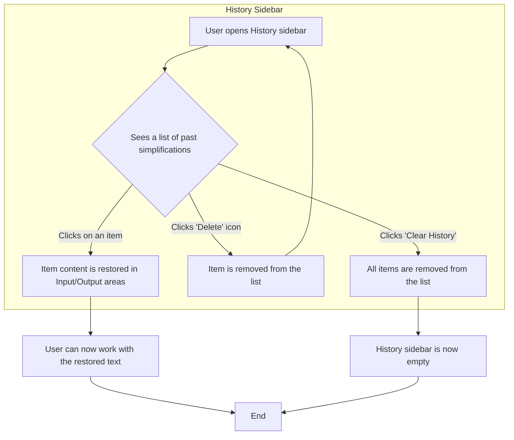

# Plain English Converter: UI/UX Documentation

## 4. User Flows

This section maps out the key user journeys within the Plain English Converter application. The diagrams are created using Mermaid flowchart syntax, which can be rendered in Figma or other compatible tools.

---

### 4.1 Text Simplification Flow

This is the primary flow for a user wanting to simplify a piece of text.

```mermaid
graph TD
    A[Start: User lands on page] --> B{Enters text in Input Area};
    B --> C{Selects a Persona};
    C --> D[Clicks "Simplify" button];
    D --> E[Output Area shows Skeleton Loader];
    subgraph AI Processing
        E --> F[API call to simplifyText];
    end
    F --> G{API returns a result};
    G -- Success --> H[Output Area displays simplified text];
    G -- Error --> I[Output Area displays error message];
    H --> J[End];
    I --> J[End];
```

---

### 4.2 Clarification Chat Flow

This flow begins after a user has successfully received a simplified output.

```mermaid
graph TD
    A[Start: Simplified text is displayed] --> B{User has a question};
    B --> C[Types question into Chat Input];
    C --> D[Clicks "Send" button];
    D --> E[Chat history updates with user's question];
    E --> F[App shows "Processing follow-up..."];
    subgraph AI Processing
        F --> G[API call to askQuestion];
    end
    G -- Success --> H[Chat history updates with AI answer];
    G -- Error --> I[An error is shown];
    H --> J{User can ask another question};
    J --> C;
    J -- No --> K[End];
    I --> K[End];
```

---

### 4.3 Vision Mode (Image Analysis) Flow

This flow describes the process of analyzing an image.

```mermaid
graph TD
    A[Start: User is on the page] --> B[Clicks "Vision" mode toggle];
    B --> C{Selects an image to upload};
    C --> D[Image preview is shown];
    D --> E[Clicks "Analyze Image" button];
    E --> F[Output Area shows Skeleton Loader];
    subgraph AI Processing
        F --> G[API call to analyzeImage];
    end
    G -- Success --> H[Output Area displays image analysis];
    G -- Error --> I[Output Area displays error message];
    H --> J[End];
    I --> J[End];
```

---

### 4.4 History Interaction Flow

This flow describes how a user interacts with their past conversions from the history sidebar.


